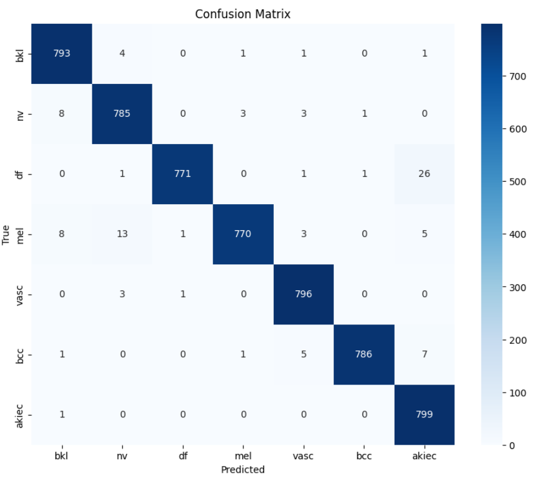

# 🔬 Skin Cancer Detection System using Deep Learning

> This project presents a system based on Machine Learning and Convolutional Neural Networks (CNN) for the classification of skin lesions. The primary goal is to aid in the early detection of seven different classes of skin disease and to increase diagnostic accuracy for timely treatment.

This work was completed as a **B.Sc. Project in Electrical Engineering** by **Amirhossein Ziyaeiii** under the supervision of **Dr. Mohammad Hossein Moaiyeri**.

---

## 📊 Dataset

This project utilizes the well-known **HAM10000 (Human Against Machine with 10000 training images)** dataset.

* This dataset includes 10,015 dermoscopic images of pigmented skin lesions.
* The data is categorized into **seven distinct diagnostic classes**:

| Abbreviation | Full Name (English) | Original Image Count |
| :--- | :--- | :--- |
| `akiec` | Actinic Keratoses | 327 images |
| `bcc` | Basal Cell Carcinoma | 514 images |
| `bkl` | Benign Keratosis-like Lesions | 1099 images |
| `df` | Dermatofibroma | 115 images |
| `mel` | Melanoma | 1113 images |
| `nv` | Melanocytic Nevi | 6705 images |
| `vasc` | Vascular Lesions | 142 images |

---

## ⚙️ Project Architecture and Methodology

The project workflow (as shown in the diagram) consists of the following key stages:

### 1. Pre-processing
* **Data Sorting:** Initial organization of images into folders corresponding to the seven disease classes.
* **Image Resizing:**
    * Images for classic ML models were resized to `220x220` pixels.
    * Images for the custom CNN model were scaled down to `96x96` pixels (with 3 color channels) for faster processing.
* **Normalization:** Pixel values were normalized to the range `0` to `1`.
* **One-Hot Encoding:** Textual class labels (e.g., 'akiec', 'bcc') were converted into one-hot vectors using `LabelBinarizer`.

### 2. Data Augmentation
Due to the significant class imbalance in the original dataset, data augmentation techniques were employed:
* **Primary Technique:** Horizontal Flip.
* **Secondary Techniques (for CNN):** To prevent overfitting, random transformations such as rotation and shearing were applied during each epoch.
* **Result:** The number of images for each class was increased to 800 samples, expanding the training dataset.

### 3. Feature Extraction
For traditional Machine Learning models (non-CNN), Global Feature Descriptors were used to quantify key image characteristics:
* **Color:** Colour Histogram
* **Texture:** Haralick Texture features
* **Shape:** Hu Moments

### 4. Modeling & Classification
Two approaches were compared:
1.  **Machine Learning (ML) Models:** (e.g., SVM, Random Forest) trained on the features extracted in the previous step.
2.  **Convolutional Neural Network (CNN):** A custom CNN model was built using `TensorFlow` and `Keras` libraries in a `Python 3` environment.

---

## 💡 CNN Model Details

The custom CNN model was configured with the following standard hyperparameters:

* **Optimizer:** `Adam` (chosen for its computational efficiency and effective performance).
* **Loss Function:** `categorical_crossentropy` (suitable for multi-class classification problems).
* **Epochs:** `30` (selected to achieve low error and minimal overfitting).

---

## 📈 Results

* **Final Accuracy:** The proposed custom CNN model successfully achieved an **accuracy of 98%**.
* **Comparison:** The results demonstrated that the Convolutional Neural Network (CNN) provided better accuracy compared to other machine learning algorithms for this task.
* **Evaluation Metrics:** Models were evaluated based on `Accuracy`, `Precision`, `Recall`, and `F1-score`.
* **Conclusion:** The method presented in this project shows higher accuracy with minimal error and information loss compared to other recent works on the same dataset.


---

## 🚀 How to Use

To run this project (the `.ipynb` notebook):

1.  First, clone the repository:
    ```bash
    git clone [https://github.com/YourUsername/your-repository-name.git](https://github.com/YourUsername/your-repository-name.git)
    cd your-repository-name
    ```

2.  (Recommended) Create a virtual environment and activate it:
    ```bash
    python -m venv venv
    source venv/bin/activate  # On Windows: .\venv\Scripts\activate
    ```

3.  Install the required libraries (if you have a `requirements.txt` file):
    ```bash
    pip install -r requirements.txt
    ```
    *Alternatively, install the key libraries:*
    ```bash
    pip install tensorflow keras pandas numpy matplotlib scikit-learn
    ```

4.  Run Jupyter Notebook or Jupyter Lab:
    ```bash
    jupyter notebook
    ```

5.  Open the project's `.ipynb` file and execute the cells in order.

---

## 📄 License

This project is licensed under the **[MIT License]**. (See the `LICENSE` file for details.)